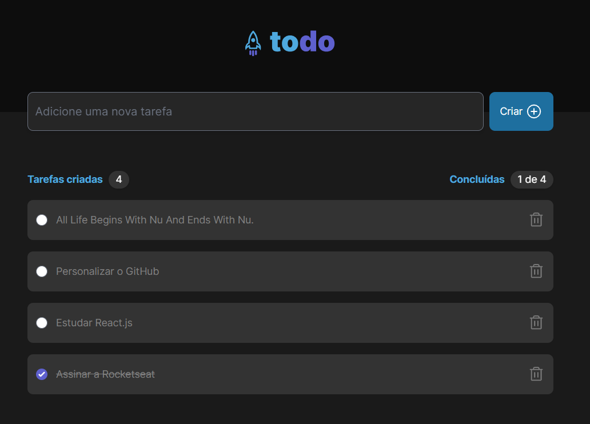

<h1 align="center"> TODO List | React.js </h1>



<h2 align="center">Descrição do projeto</h2>

<p align="justify">
 Projeto foi desenvolvido como um dos projetos opcionais, da trilha React.js (2022) da <a href="https://rocketseat.com.br/">Rocketseat</a>. A aplicação permitirá a adição, conclusão e remoção de uma tarefa do seu dia-a-dia

###

<h2 align="center">Acesso ao projeto</h2>

Você pode [acessar o código fonte do projeto](https://github.com/gabrieltdrk/todolist-reactjs) ou cloná-lo utilizando o seguinte comando:
```
git clone https://github.com/gabrieltdrk/todolist-reactjs.git
```
Após realizar o clone, basta utilizar o seguinte comando
```
cd todolist-reactjs
npm install
npm run dev
```
<div align="center">Coded by <a href="https://github.com/gabrieltdrk">gabrieltdrk</a>.</div>
